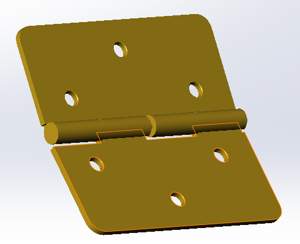

# Hinge Assembly

  

## Overview

This repository showcases a hinge assembly designed in **SolidWorks** to demonstrate my expertise in sheet metal design, CAD modeling, and technical documentation. The project includes a complete hinge assembly, individual part models, technical drawings with Geometric Dimensioning and Tolerancing (GD&T), and STEP files for interoperability. The design incorporates clearance fit to ensure free rotation and a hinge mate for accurate assembly motion, highlighting skills in precision engineering and manufacturability for sheet metal applications.

## Demo Video

[Click here to watch the Hinge animation video](https://desireloft.github.io/hinge/hinge.html)

## Project Details

The hinge assembly is a mechanical component designed to enable rotational movement between two parts, commonly used in enclosures, doors, or machinery. The project emphasizes proficiency in:

- Sheet metal design using hem command.
- Assembly modeling with functional motion (hinge mate).
- Technical drawing creation with GD&T for manufacturing accuracy.
- Exporting interoperable STEP files for prototyping or collaboration.
- Consideration of manufacturing processes (e.g. machining) and rapid prototyping workflows.

### Components

The hinge assembly consists of the following key models:

1. **Hinge**:
   - The primary sheet metal component, typically a leaf or plate, designed with bent flanges to support the hinge pin.
   - Optimized for sheet metal fabrication (e.g., stamping, bending) with precise bend radii.
2. **Hinge Pin**:
   - A cylindrical pin that connects the hinge leaves, enabling rotational movement.
   - Designed with clearance fit to ensure free rotation without binding.
3. **Hinge Assembly**:
   - The complete assembly integrating the hinge leaves and pin.
   - Features a **hinge mate** in SolidWorks to simulate realistic rotational motion.
   - Includes an **exploded view** in the technical drawing to illustrate assembly sequence.

### Technical Drawings

- **Individual Part Drawings**:
  - Detailed drawings for HINGE and HINGE PIN.
  - Include dimensions, **GD&T** annotations, and clearance fit specifications to ensure free rotation.
- **Assembly Drawing**:
  - Comprehensive drawing for `HINGE_ASSY.SLDASM` with an exploded view.
  - Includes a **Bill of Materials (BOM)** listing all components.
- **PDF Exports**:
  - All drawings are exported as PDFs for easy sharing and review (located in the `PDF/` folder).

### STEP Files

- STEP files (`.stp`) are provided for all parts and the assembly (`0003.stp`) to enable:
  - Interoperability with other CAD software (e.g., Fusion 360, ETC.).
  - Rapid prototyping.
  - Compatibility with CNC machining or sheet metal fabrication.
